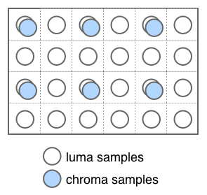
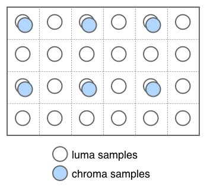
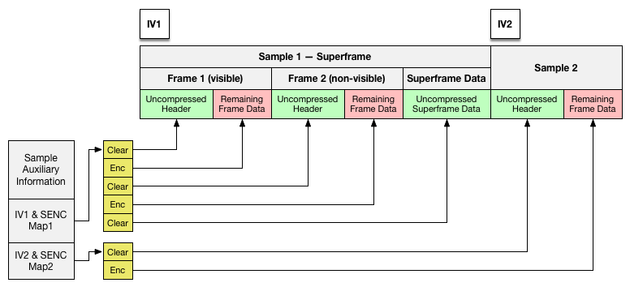

VP Codec ISO Media File Format Binding
======================================

v1.1 2023-11-01

_Frank Galligan, Google  
Kilroy Hughes, Microsoft  
Thom&aacute;s Inskip, Google  
David Ronca, Netflix_

Introduction
------------

This document specifies a general ISO Base Media track and sample format for
video encoded with Video Partition structured video codecs ("VP"), such as
MPEG VCB (MPEG-4 Part 31), VP8, VP9, and others.

Authoritative Source
--------------------

The authoritative source of this document resides in the
[vp9-dash GitHub repository](https://github.com/webmproject/vp9-dash).

Normative References
--------------------

  * [VP9 Bitstream and Decoding Process Specification](https://storage.googleapis.com/downloads.webmproject.org/docs/vp9/vp9-bitstream-specification-v0.6-20160331-draft.pdf)

  * ISO/IEC 14496‐12, Information technology -- Coding of audio-visual objects
    -- Part 12: ISO base media file format

  * ISO/IEC 23001-7 second edition 2015-0401, Part 7:  Information technology
    -- MPEG systems technologies -- Common encryption in ISO base media file
    format files

  * SMPTE ST 2086:2014, Mastering Display Color Volume Metadata Supporting
    High Luminance and Wide Color Gamut Images

Data Types and Fields
---------------------

Fixed-point numbers are signed or unsigned values that result from dividing an
integer by an appropriate power of 2. For example, a 0.16 fixed-point number
is formed by dividing a 16-bit integer by 2^16.

Basic Encapsulation Scheme
--------------------------

This section describes the basic data structures used to signal encapsulation
of VP-encoded video in ISO-BMFF containers.

### VP Codec Sample Entry Box

The VP Codec Sample Entry box describes the sample entry and sample format for
VP elementary streams.

#### Definition

|           |                                                  |
| --------- | ------------------------------------------------ |
| Box Type  | 'vp_xx_' where 'xx' is one of '08' or '09'       |
| Container | Sample Description Box ('stsd')                  |
| Mandatory | Yes, for VP codec tracks                         |
| Quantity  | Exactly one                                      |

The 'vpxx' Sample Entry Box specifies the coding of Video Partition Codec
samples, and contains a 'vpcC' box that contains decoding and display
configuration information. 'vpxx' indicates the generic class used to
generate a box instance, identified by the 4CC of the specific codec used.
The 4CC codes currently defined by this spec are 'vp08' and 'vp09'.

#### Syntax

~~~~~
class VP8SampleEntry extends VisualSampleEntry('vp08') {
    VPCodecConfigurationBox    config;
}

class VP9SampleEntry extends VisualSampleEntry('vp09') {
    VPCodecConfigurationBox    config;
}
~~~~~

#### Semantics

**width, height, horzresolution, vertresolution** SHALL be encoded as an
upper bound of the video in the container. VP9 supports on-the-fly decoding
of dynamic video resolutions, so these fields SHALL contain the highest values
of any portion of the video stream.

**compressorname** is an informative name. It is formatted in a fixed 32-byte
field, with the first byte set to the number of bytes to be displayed,
followed by that number of bytes of displayable data, followed by padding to
complete 32 bytes total (including the size byte). The field MAY be set to 0.
The value "\012VPC Coding" is RECOMMENDED; the first byte is a count of the
remaining bytes, here represented by \012, which (being octal
12) is decimal 10, the number of bytes in the rest of the string

**config** is defined in the following section.

### VP Codec Configuration Box

#### Definition

|           |                                    |
| --------- | ---------------------------------- |
| Box Type  | 'vpcC'                             |
| Container | VP Codec Sample Entry Box ('vpxx') |
| Mandatory | Yes                                |
| Quantity  | Exactly One                        |

#### Description

The VP Codec Configuration Box is contained in every VP Codec Sample Entry
Box. It exposes the general video parameters in standard fields, useful for
track selection and display. It also contains decoder initialization
information specific to the codec and sample format indicated by the 4CC code
of the sample entry box that contains it. All parameters must be valid for
every sample that references the sample entry, and equal the parameter value
unless otherwise noted.

#### Syntax

~~~~~
class VPCodecConfigurationBox extends FullBox('vpcC', version = 1, 0) {
      VPCodecConfigurationRecord() vpcConfig;
}

aligned (8) class VPCodecConfigurationRecord {
    unsigned int (8)     profile;
    unsigned int (8)     level;
    unsigned int (4)     bitDepth;
    unsigned int (3)     chromaSubsampling;
    unsigned int (1)     videoFullRangeFlag;
    unsigned int (8)     colourPrimaries;
    unsigned int (8)     transferCharacteristics;
    unsigned int (8)     matrixCoefficients;
    unsigned int (16)    codecIntializationDataSize;
    unsigned int (8)[]   codecIntializationData;
}
~~~~~

#### Semantics

**version** is an integer that specifies the version of this box, should be 1.
Version 0 is deprecated and should not be used.

**profile** is an integer that specifies the VP codec profile. The value of
profile MUST be valid for all samples that reference this sample entry, that
is, profile SHALL be equal to the profile used to encode the sample.

| Profile | Color Depth  | Chroma Subsampling |
|:-------:|:------------:|:------------------:|
| 0       | 8 bit/sample | 4:2:0              |
| 1       | 8 bit        | 4:2:2, 4:4:4       |
| 2       | 10 or 12 bit | 4:2:0              |
| 3       | 10 or 12 bit | 4:2:2, 4:4:4       |

Note: VP8 only supports a profile value of 0.

**level** is an integer that specifies a VP codec level all samples conform
to the following table. For a description of the various levels, please refer
to the VP9 Bitstream Specification [^1].

| Value | Level                       |
|:-----:|:---------------------------:|
| 10    | Level 1                     |
| 11    | Level 1.1                   |
| 20    | Level 2                     |
| 21    | Level 2.1                   |
| 30    | Level 3                     |
| 31    | Level 3.1                   |
| 40    | Level 4                     |
| 41    | Level 4.1                   |
| 50    | Level 5                     |
| 51    | Level 5.1                   |
| 52    | Level 5.2                   |
| 60    | Level 6                     |
| 61    | Level 6.1                   |
| 62    | Level 6.2                   |

**bitDepth** is an integer that specifies the bit depth of the luma and color
components. Valid values are 8, 10, and 12. This value may be further
constrained by the profile.

**chromaSubsampling** is an integer that specifies the chroma subsampling.
Only the values in the following table are allowed. This value may be further
constrained by the profile. If `matrixCoefficients` is 0 (RGB), then chroma
subsampling MUST be 3 (4:4:4).

| Value | Subsampling|
|:-----:|:--------------------------------:|
| 0     | 4:2:0 vertical                   |
| 1     | 4:2:0 colocated with luma (0,0)  |
| 2     | 4:2:2                            |
| 3     | 4:4:4                            |
| 4..7  | Reserved                         |

Figure 1: 4:2:0 Subsampling with vertical chroma samples

Figure 2: 4:2:0 chroma subsampling colocated with (0,0) luma

**videoFullRangeFlag** indicates the black level and range of the luma and
chroma signals. 0 = legal range (e.g. 16-235 for 8 bit sample depth); 1 = full
range (e.g. 0-255 for 8-bit sample depth).

**colourPrimaries** is an integer that is defined by the "Colour primaries"
section of ISO/IEC 23001-8:2016.

**transferCharacteristics** is an integer that is defined by the "Transfer
characteristics" section of ISO/IEC 23001-8:2016.

**matrixCoefficients** is an integer that is defined by the "Matrix
coefficients" section of ISO/IEC 23001-8:2016.

**codecIntializationDataSize** MUST be 0 for VP8 and VP9.

**codecIntializationData** is not used for VP8 and VP9 . Intended for binary
codec initialization data.

Video Samples
-------------

Video sample storage in the generic binding uses a simple mapping to frames
defined in the codec specification. The height and width in the Visual Sample
Entry are specified in square pixels. If the video pixels are not square, then
a 'pasp' box MUST be included. Altref (alternate reference) frames MUST be
part of a superframe structure.

Note: VP8 does not support superframes, and so it is not possible to carry VP8
using this specification if the VP8 stream includes altref frames.[^2]

Carriage of HDR Metadata
------------------------

This section specifies a model for carrying VP codec HDR metadata.

### SMPTE-2086 Mastering Display Metadata Box

This box contains SMPTE-2086 Mastering Display Metadata information.

#### Definition

|           |                                  |
| --------- | -------------------------------- |
| Box Type  | 'SmDm'                           |
| Container | Visual Sample Entry Box ('vpxx') |
| Mandatory | No                               |
| Quantity  | Exactly one                      |

~~~~~
class SMPTE2086MasteringDisplayMetadataBox extends Fullbox('SmDm', 0, 0) {
    uint16 primaryRChromaticity_x;
    uint16 primaryRChromaticity_y;
    uint16 primaryGChromaticity_x;
    uint16 primaryGChromaticity_y;
    uint16 primaryBChromaticity_x;
    uint16 primaryBChromaticity_y;
    uint16 whitePointChromaticity_x;
    uint16 whitePointChromaticity_y;
    uint32 luminanceMax;
    uint32 luminanceMin;
}
~~~~~

#### Semantics

**primaryRChromaticity_x** is a 0.16 fixed-point Red X chromaticity coordinate
as defined by CIE 1931

**primaryRChromaticity_y** is a 0.16 fixed-point Red Y chromaticity coordinate
as defined by CIE 1931

**primaryGChromaticity_x** is a 0.16 fixed-point Green X chromaticity
coordinate as defined by CIE 1931

**primaryGChromaticity_y** is a 0.16 fixed-point Green Y chromaticity
coordinate as defined by CIE 1931

**primaryBChromaticity_x** is a 0.16 fixed-point Blue X chromaticity
coordinate as defined by CIE 1931

**primaryBChromaticity_y** is a 0.16 fixed-point Blue Y chromaticity
coordinate as defined by CIE 1931

**whitePointChromaticity_x** is a 0.16 fixed-point White X chromaticity
coordinate as defined by CIE 1931

**whitePointChromaticity_y** is a 0.16 fixed-point White Y chromaticity
coordinate as defined by CIE 1931

**luminanceMax** is a 24.8 fixed point Maximum luminance, represented in
candelas per square meter (cd/m²)

**luminanceMin** is a 18.14 fixed point Minimum luminance, represented in
candelas per square meter (cd/m²)

### Content Light Level Box

This box contains content light level information.

#### Definition

|           |                                  |
| --------- | -------------------------------- |
| Box Type  | 'CoLL'                           |
| Container | Visual Sample Entry Box ('vpxx') |
| Mandatory | No                               |
| Quantity  | Exactly one                      |

The 'coll' box is used to provide the Maximum Content Light Level (maxCLL) and
Maximum Frame-Average Light Level (maxFALL), calculated as specified in
CEA-861.3, Appendix A. These values are coded as unsigned 16-bit integers. The
units for these fields are cd/m2 when the brightest pixel in the entire video
stream has the chromaticity of the white point of the encoding system used to
represent the video stream.

#### Syntax

~~~~~
class ContentLightLevelBox extends Fullbox('CoLL', 0, 0) {
    uint16 maxCLL;
    uint16 maxFALL;
}
~~~~~

#### Semantics

**maxCLL** is a 16-bit integer that specifies the Maximum Content Light Level
as specified in CEA-861.3, Appendix A.

**maxFALL** is a 16-bit integer that specifies the Maximum Frame-Average Light
Level as specified in CEA-861.3, Appendix A.

Common Encryption
-----------------

This section specifies how to signal Common Encryption for VP video streams,
as well as VP sample partition into clear and encrypted subsamples.

### Scheme Info Box (sinf)

If the VP9 data is encrypted, the Protection Scheme Info box ('sinf') SHALL be
present, and SHALL contain a Scheme Type ('schm') box. The scheme\_type field
of the 'schm' box SHALL be 'cenc', indicating that AES-CTR encryption is used
when samples are encrypted.

### Sample Encryption

VP8 and VP9 samples packaged using this specification use sub-sample
encryption, as specified in section 10.6 of "ISO/IEC 23001-7 Part 7: Common
encryption in ISO base media file format files". The subsample encryption
table MAY be implemented using the 'senc' box described in section 8.1 of
"ISO/IEC 23001-7 Part 7" or the 'saio' and 'saiz' boxes described in section
8.7 of "14496-12".

When encrypting VP9 video frames, the uncompressed header MUST be unencrypted.
Block alignment is achieved by adjusting the size of the unencrypted bytes
that precede the encrypted bytes for the frame. A subsample encryption (SENC)
map MUST be used to identify the clear and encrypted bytes of each video
sample. This is illustrated in Figure #3.

When encrypting superframes, the uncompressed headers of the displayed frame,
the uncompressed headers for all altref frames, and the superframe header MUST
be clear. The encrypted bytes of each frame within the superframe MUST be
block-aligned so that the counter state can be computed for each frame within
the superframe.

Figure 3: Sample-based VP9 encryption with clear uncompressed header

Codecs Parameter String
-----------------------

DASH and other applications require defined values for the 'Codecs' parameter
specified in RFC-6381 for ISO Media tracks. The codecs parameter string for
the VP codec family is as follows:

~~~~~
<sample entry 4CC>.<profile>.<level>.<bitDepth>.<chromaSubsampling>.
<colourPrimaries>.<transferCharacteristics>.<matrixCoefficients>.
<videoFullRangeFlag>
~~~~~

All parameter values are expressed as double-digit decimals. Their semantics
are explained in the VPCodecConfigurationBox Semantics section above.

For example, `codecs="vp09.02.10.10.01.09.16.09.01"` represents VP9 profile 2,
level 1, 10-bit YUV content, with 4:2:0 chroma subsampling, ITU-R BT.2020
primaries, ST 2084 EOTF, ITU-R BT.2020 non-constant luminance color matrix,
and full-range chroma/luma encoding.

### Mandatory Fields

**sample entry 4CC**, **profile**, **level**, and **bitDepth** are all
mandatory fields. If any of these fields are empty, or not within their
allowed range, the processing device SHALL treat it as an error.

### Optional Fields

**colourPrimaries**, **transferCharacteristics**, **matrixCoefficients**,
**videoFullRangeFlag**, and **chromaSubsampling** are OPTIONAL, mutually
inclusive (all or none) fields. If not specified then the processing device
MUST use the values listed in the table below as defaults when deciding if the
device is able to decode and potentially render the video.

| Field | Default Value                                              |
|:-----:|:----------------------------------------------------------:|
| **chromaSubsampling**       | 1 (4:2:0 colocated with luma (0,0))  |
| **colourPrimaries**         | 1 (ITU-R BT.709)                     |
| **transferCharacteristics** | 1 (ITU-R BT.709)                     |
| **matrixCoefficients**      | 1 (ITU-R BT.709)                     |
| **videoFullRangeFlag**      | 0 (legal range)                      |

The string `codecs="vp09.00.41.08"` in this case would represent VP9 profile
0, level 4.1, 8-bit YUV content with 4:2:0 chroma subsampling, ITU-R BT.709
color primaries, transfer function and matrix coefficients, and luma/chroma
encoded in the "legal" range.

* * *

[^1]: [VP9 Bitstream and Decoding Process Specification](https://storage.googleapis.com/downloads.webmproject.org/docs/vp9/vp9-bitstream-specification-v0.6-20160331-draft.pdf)

[^2]: A model for carriage of VP8 ALTREF frames may be considered for a future version of this specification.
